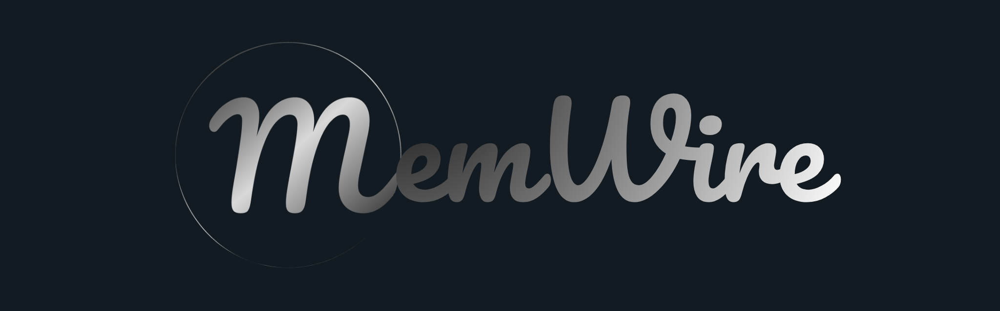

# MemWire

<p align="center">
  
</p>

> Enterprise-grade, self-hosted AI memory infrastructure layer. Deploy persistent AI memory on-premise or in any cloud with your own LLM and database.

[](https://pypi.org/project/memwire/)


[](https://discord.gg/pGeS7CCcem)

## What is MemWire?

MemWire is **an open source & enterprise-ready** AI memory infrastructure layer. MemWire gives your AI applications persistent, auditable memory with structured, updatable facts, **fastest** semantic retrieval across conversations and knowledge using **graph-based memory**.

- [Fully customizable](https://memwirelabs.ai/configuration) — adapt schemas, memory types, and pipelines to your use case
- Self-hosted — run entirely on your local machine, on-premise or in your own cloud
- [Multi-tenant](https://memwirelabs.ai/features/multi-tenancy) — isolate applications, users, and workspaces securely
- Bring your own database — PostgreSQL pgvector, Qdrant, Pinecone, ChromaDB, Weawiate or your preferred stack
- Bring your own LLM — OpenAI, Anthropic, Gemini, Ollama, or any provider
- Deploy anywhere — edge, private cloud, public cloud, air-gapped environments
- [Knowledge ingestion](https://memwirelabs.ai/features/knowledge-base) — ingest documents (PDF, Excel, CSV, etc.) alongside conversation memory; recalled together at query time
- Auditable — every memory is traceable, categorized (fact, preference, instruction, event, entity), and inspectable
- [Feedback loop](https://memwirelabs.ai/features/adaptive-feedback) — reinforce memory paths that led to good responses; unused edges decay over time

---

## Quickstart

### Python SDK

#### Install

```bash
pip install memwire
```

---

#### Embedded mode

Data is stored on disk in `./memwire_data/`.

```python
from memwire import MemWire, MemWireConfig

config = MemWireConfig(
    qdrant_path="./memwire_data",  # local vector store
    qdrant_collection_prefix="app_",
)
memory = MemWire(config=config)

USER_ID = "alice"

# Add messages to memory
records = memory.add(
    user_id=USER_ID,
    messages=[{"role": "user", "content": "I prefer dark mode and short answers."}],
)
for r in records:
    print(f"[stored] ({r.category}) {r.content}")

# Recall relevant context for a query
result = memory.recall("How should I format my answers?", user_id=USER_ID)
if result.formatted:
    print(result.formatted)
    # → "alice prefers dark mode and short answers."

# Inject recalled context into your LLM prompt
messages = [
    {"role": "system", "content": "You are a helpful assistant."},
]
if result.formatted:
    messages.append(
        {"role": "system", "content": f"Memory context:\n{result.formatted}"}
    )
messages.append({"role": "user", "content": "How should I format my answers?"})

# After you get the LLM response, reinforce the memory paths that were used
memory.feedback(assistant_response="<assistant response here>", user_id=USER_ID)

# Search memories by keyword / semantic similarity
hits = memory.search("dark mode", user_id=USER_ID, top_k=5)
for record, score in hits:
    print(f"[{score:.2f}] ({record.category}) {record.content}")

# Inspect stats
stats = memory.get_stats(user_id=USER_ID)
print(stats)  # {"memories": 1, "nodes": ..., "edges": ..., "knowledge_bases": 0}

# Always close to flush background writes
memory.close()
```

---

#### With a local Qdrant server

```bash
docker run -p 6333:6333 qdrant/qdrant
```

```python
config = MemWireConfig(
    qdrant_url="http://localhost:6333",
    qdrant_collection_prefix="app_",
)
memory = MemWire(config=config)
```

---

### REST API

The `api/` folder provides a self-hosted REST API backed by FastAPI and Qdrant.

#### Start the server

```bash
cd api
docker compose up --build   # Qdrant + MemWire API on :8000
```

---

#### Store memory

```bash
curl -X POST http://localhost:8000/v1/memories \
  -H "Content-Type: application/json" \
  -d '{
    "user_id": "alice",
    "app_id": "app_a",
    "workspace_id": "team_1",
    "messages": [
      { "role": "user", "content": "I prefer dark mode and short answers." }
    ]
  }'
```

```json
[
  {
    "memory_id": "mem_3f7a1c2d9e4b",
    "user_id": "alice",
    "content": "I prefer dark mode and short answers.",
    "role": "user",
    "category": "preference",
    "strength": 1.0
  }
]
```

---

#### Recall context

```bash
curl -X POST http://localhost:8000/v1/memories/recall \
  -H "Content-Type: application/json" \
  -d '{
    "user_id": "alice",
    "app_id": "app_a",
    "workspace_id": "team_1",
    "query": "How should I format my answers?"
  }'
```

```json
{
  "query": "How should I format my answers?",
  "supporting": [{ "tokens": ["dark", "mode"], "score": 0.87, "memories": [...] }],
  "conflicting": [],
  "knowledge": [],
  "formatted": "alice prefers dark mode and short answers.",
  "has_conflicts": false
}
```

---

#### Search memories

```bash
curl -X POST http://localhost:8000/v1/memories/search \
  -H "Content-Type: application/json" \
  -d '{
    "user_id": "alice",
    "app_id": "app_a",
    "workspace_id": "team_1",
    "query": "dark mode",
    "limit": 10
  }'
```

```json
[
  {
    "memory": {
      "memory_id": "mem_3f7a1c2d9e4b",
      "content": "I prefer dark mode and short answers.",
      "category": "preference"
    },
    "score": 0.94
  }
]
```

See [API Reference](https://memwirelabs.ai/api-reference/introduction) for configuration options and local development setup.

## Customization

All MemWire behaviour is controlled through `MemWireConfig`. Choose your vector store, embedding model, and LLM provider, then tune recall and graph settings to fit your use case. [Learn more](https://memwirelabs.ai/configuration).

## Supported databases

| Storage | Type | Status | Notes |
|---|---|---|---|
| [Qdrant](https://qdrant.tech) | Vector store | ✅ Supported | Embedded, local server, or Qdrant Cloud |


## Supported LLMs

MemWire is model-agnostic. Memory operations like storage, recall, and search work with any language model or provider.

| Provider | Example |
|---|---|
| OpenAI | [examples/openai/](examples/openai/) |
| Azure OpenAI | [examples/azure-openai/](examples/azure-openai/) |
| Anthropic, Gemini, Ollama, or any other | Pass the recalled context into any LLM |


## Roadmap

See [ROADMAP.md](ROADMAP.md) for the full plan.


## Contributing

PRs and issues are welcome. See [CONTRIBUTING.md](CONTRIBUTING.md) and [GOVERNANCE.md](GOVERNANCE.md).

## License

[Apache License 2.0](LICENSE)
